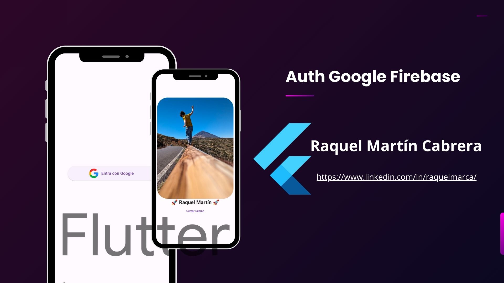

# Google Auth With Firebase

Example to Auth Google on Flutter

## Getting Started

- Required Node v20+
- Get a fork of this project
- install dependencies `flutter get pub`
- You need a project on Firebase

## Official Documentation

A few resources to get you started if this is your first Flutter project:

- [Flutter](https://flutter.dev/)
- [Firebase](https://firebase.google.com/docs?hl=es)
- [Firebase core](https://pub.dev/packages/firebase_core)
- [Firebase Auth](https://pub.dev/packages/firebase_auth)

